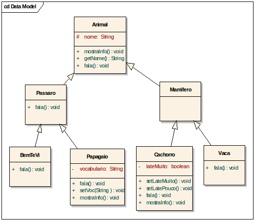

# Programação Orientada a Objetos
# Herança

## Exercício 1

De acordo com o Diagrama abaixo, implemente as classes procurando sempre reutilizar código escrito nas superclasses, sabendo que:


```
Na classe Animal
void imp()              // imprime o nome e  a classe do animal
String getNome()
void  fala()            // “Eu não falo”

Na classe Pássaro
void fala()             // “piu, piu.”

Na classe BemTeVi
void fala()             // “bem-te-vi”

Na classe Papagaio
String vocabulario      // frase

void fala()             // exibe vocabulário
void setVoc(String v)   // altera vocabulário

Na classe Cachorro

boolean lateMuito

void setLateMuito()
void setLatePouco()
void fala()             // “AU! AU!” ou “au, au...”

Na classe Vaca

void fala()             // “Muuu...”
```

## Exercício 2

Crie uma classe chamada TesteAnimal que cria objetos de todas as classes criadas. Faça chamada aos métodos criados a partir dos objetos associados. Crie exemplos de chamadas que ocorrem erros de compilação

## Exercício 3

Crie duas subclasses para a classe Cachorro, criando nestas uma variável e um método em particular. Ainda, crie nestas o método mostraInfo(). Procure sempre reutilizar código já criado. Altere a classe TesteAnimal do exercício anterior de modo a testar os novos métodos criados.

## Exercício 4

Faca uma classe Produto que contenha o numero serial (inteiro), o volume (inteiro) e também uma string que inicialmente possui o valor "nao testado". O numero serial e o volume serão passados no construtor. Deverá possuir um método booleano testaUnidade que somente poderá ser executado uma vez. O produto terá 90% de chance de estar OK. Caso esteja OK, a string passara de "nao testado" para "aprovado". Caso nao esteja OK, passara para "reprovado". Retorna true se foi aprovado e false se não foi. Devera também conter um método setaVolume para atribuir valor a Volume, e um método toString que retornara em uma string o numero serial, o volume e o resultado do teste.
(obs:  java.lang.Math.random() gera um numero de 0.0 a 1.0)

Em seguida, faça uma classe Radio que ira herdar de Produto. Devera ter um método Escutar que retornara uma String contendo a estação e a banda (ex.: 94.9 FM) da radio. Devera conter um método trocaEstacao e um método trocaBanda. Devera alterar o método toString de forma a acrescentar a estação e a banda.

Continuando, faça uma classe TV que ira herdar de Produto. Devera ter um método Assistir que retornara uma String contendo o canal que está assistindo. Devera conter um método trocaCanal. Devera alterar o toString de forma a acrescentar o canal.

Faca uma classe teste chamada Controle que ira receber um produto, testá-lo e imprimir seu status (método toString). Após o teste, o usuário poderá alterar os valores do Produto (Rádio ou TV).

Obs: a implementação deve conter um exemplo de polimorfismo

## Exercício 5

Faca o jogo Papel, Pedra e Tesoura. Devera conter uma classe Coisa que será a superclasse de Papel, Pedra e Tesoura. Devera conter uma classe Jogo que ficara jogando o tempo todo. (Aqui vem o famoso: Coisa c1 = new Pedra(); ) Faca o computador escolher aleatoriamente que objetos ele ira escolher e vá imprimindo os resultados. Note que durante os confrontos o método que receber os dois objetos devera receber duas coisas sem saber exatamente que tipo e. Neste caso, usando os métodos específicos de cada um devera fazer a comparação. Papel ganha de Pedra (envolve), Pedra ganha de tesoura (quebra) e Tesoura ganha de Papel (Corta).

## Exercício 6

Faca uma classe Conta que contenha o nome do cliente, salário do cliente, o numero da conta, o saldo e o limite. Estes valores deverão ser informados no construtor, sendo que o limite nao podera ser maior que o valor do salário mensal do cliente. Faca um método deposito e um método retira. O método retira ira devolver true ou false, dependendo se o cliente pode retirar. Faca um método saldo que retorne o saldo do cliente.

## Exercício 7

Faca uma classe ContaEspecial que funciona como a classe Conta, mas que aceite um limite de ate 3x o valor do salário do cliente.

## Exercício 8

Faca uma classe Cartao que receba um objeto do tipo conta e uma senha. Devera conter um método retirada e um método saldo, semelhante à classe Conta, mas que receba uma senha que devera ser a mesma armazenada no cartão. Faca também um método que altere a senha, desde que receba a senha antiga como parâmetro.
