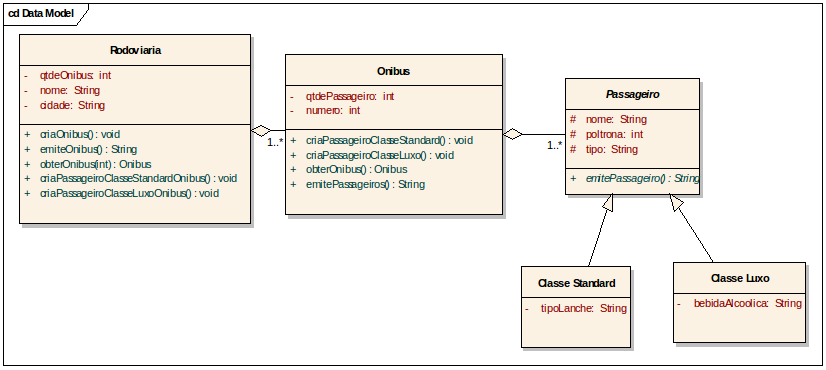
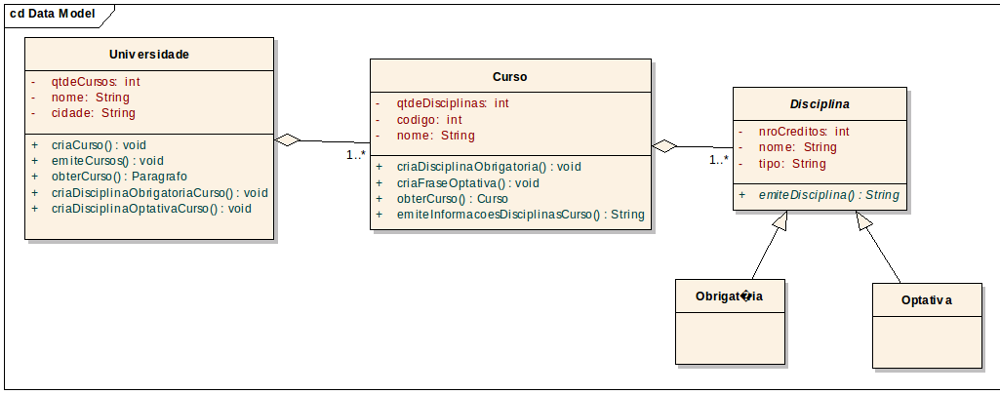

# Lista de Abstração, Herança, Polimorfismo, Coersão e Composição
# Prof. Daniel Pires

## 1º Exercício

De acordo com o Diagrama de Classes da UML a seguir, responda:
Obs: os sinais + indicam visibilidade pública, os sinais – indicam visibilidade privada e os sinais # indicam visibilidade protegida

a. Implemente em Java as classes Passageiro, Classe Standard e Classe Luxo. O método emitePassageiro retorna todas as informações da classe onde este está presente. Não se esqueça de definir os construtores.

b. Implemente em Java a classe Onibus, definindo os métodos construtores.

c. Implemente em Java o método criaPassageiroClasseStandard da classe Onibus, que recebe os valores necessários como parâmetro

d. Implemente em Java o método obterOnibus da classe Onibus que retorna um Onibus

e. Implemente em Java o método emitePassageiros da classe Onibus, que retorna em uma String as informações de todos os passageiros do onibus

f. Implemente em Java a classe Rodoviaria, definindo os construtores.

g. Implemente em Java o método criaOnibus da classe Rodoviaria, que recebe os valores necessários como parâmetro

h. Implemente em Java o método emiteOnibus da classe Rodoviaria, que retorna em uma String as informações de todos os onibus, e para cada onibus, as informações de todos os seus passageiros

i. Implemente em Java o método obterOnibus da classe Rodoviaria, que recebe um número de onibus e retorna este onibus

j. Implemente em Java o método criaPassageiroClasseStandardOnibus() da classe Rodoviaria, que recebe os valores necessários como parâmetro

k. Suponha que esteja na classe TestaRodoviaria, crie um objeto da classe Rodoviaria e faça chamada aos métodos implementados na mesma

## 2º Exercício

Implemente o Diagrama a seguir em linguagem Java. Em seguida, crie uma classe TestaUniversidade que teste todos os métodos da classe Universidade

