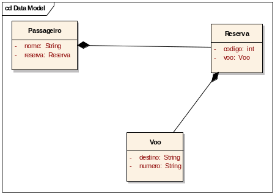
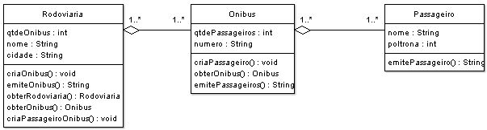
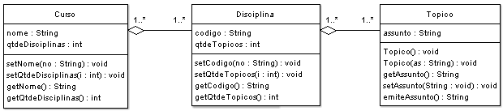

# Lista de Exercícios 4

Lista de exercícios propostos pelo **Prof. Daniel Facciolo Pires**.

+ Associação

Acesse os **[Códigos](https://github.com/getuliovinicius/programacao.orientada.objeto)**.

## Exercício 1

De acordo com o Diagrama de Classes da UML acima:

+ Crie as classes Passageiro, Reserva e Vôo, bem como suas variáveis. Todas as variáveis são encapsuladas.
+ Crie os métodos construtores sem parâmetro e com parâmetros para todas as classes
+ Crie os métodos:
    a) set e get da classe Vôo
    b) set e get da classe Reserva
    c) set e get da classe Passageiro
+ Crie um método de instância na classe Voo que mostra as informações da classe Voo;
+ Crie um método de instância na classe Reserva que mostra as informações da classe Reserva;
+ Crie um método de instância na classe Passageiro que mostra as informações da classe Passageiro;
+ Crie uma classe chamada TestaPassageiro que cria instâncias da classe Passageiro, e testa todos os métodos criados nos itens anteriores

## Exercício 2

De acordo com o Diagrama de Classes da UML acima, implemente os métodos:

+ Passageiro
    + construtores
    + getters e setters
    + public String mostra()
+ Onibus
    + construtores
    + getters e setters
    + public String mostra()
    + public void associaPassageiro(Passageiro passageiro){
    + public boolean desvincularPassageiro(Passageiro passageiro){
    + public boolean obterPassageiro(Passageiro passageiro)
    + public boolean obterPassageiro(String cpf){
    + private int obterPosicaoPassageiro(Passageiro passageiro){
    + private int obterPosicaoPassageiro(String cpf){
    + public boolean atualizaPassageiro(Passageiro passageiro){
+ Rodoviaria
    + construtores
    + getters e setters
    + public String mostra()
    + public void associaOnibus(Onibus onibus){
    + public boolean associaPassageiroOnibus(Onibus on, Passageiro pas){
    + public boolean desvinculaOnibus(Onibus onibus){
    + public boolean desvinculaPassageiroOnibus(Passageiro passageiro, Onibus onibus)
    + public boolean obterOnibus(Onibus onibus)
    + public boolean obterPassageiroOnibus(Onibus onibus, Passageiro passageiro)
    + public boolean obterOnibus(int numero)
    + private int obterPosicaoOnibus(Onibus onibus)
    + private int obterPosicaoOnibus(int numero)
    + public boolean atualizaOnibus(Onibus atual, Onibus novo)
    + public boolean atualizaPassageiroOnibus(Onibus onibus, Passageiro passageiro)
+ Faça o TestaRodoviaria para chamar os métodos criados na Rodoviária.

## Exercício 3

De acordo com o Diagrama de Classes da UML acima, implemente os métodos:

+ Topico
    + construtores
    + getters e setters
    + public String mostra()
+ Disciplina
    + construtores
    + getters e setters
    + public String mostra()
    + public void associaTopico(Topico topico){
    + public boolean desvincularTopico(Topico topico){
    + public boolean obterTopico(Topico topico)
    + public boolean obterTopico(String cpf){
    + private int obterPosicaoTopicoo(Topico topico){
    + private int obterPosicaoTopico(String cpf){
    + public boolean atualizaTopico(Topico topico){
+ Curso
    + construtores
    + getters e setters
    + public String mostra()
    + public void associaDisciplina(Disciplina disciplina){
    + public boolean associaTopicoDisciplina(Disciplina disciplina, Topico topico){
    + public boolean desvinculaDisciplina(Disciplina disciplina){
    + public boolean desvinculaTopicoDisciplina(Disciplina disciplina, Topico topico)
    + public boolean obterDisciplina (Disciplina disciplina)
    + public boolean obterTopicoDisciplina (Disciplina disciplina, Topico topico)
    + public boolean obterDisciplina(int numero)
    + private int obterPosicaoDisciplina(Disciplina disciplina)
    + private int obterPosicaoDisciplina(int numero)
    + public boolean atualizaDisciplina (Disciplina disciplina)
    + public boolean atualizaPassageiroOnibus(Disciplina disciplina, Topico topico)
+ Faça o TestaCurso para chamar os métodos criados no Curso.
