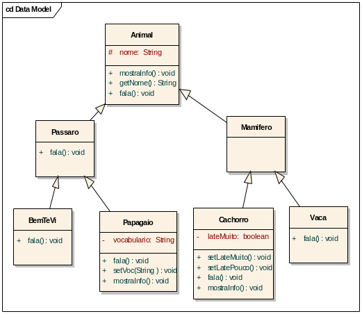

# Lista de Exercícios 5

Lista de exercícios propostos pelo **Prof. Daniel Facciolo Pires**.

+ Herança

Acesse os **[Códigos](https://github.com/getuliovinicius/programacao.orientada.objeto)**.

## Exercício 1



De acordo com o Diagrama acima, implemente as classes procurando sempre reutilizar código escrito nas superclasses, sabendo que:

Na classe Animal:

```Java
void imp()                // imprime o nome e a classe do animal
String getNome()
String fala()             // “Eu não falo.”
```

Na classe Passaro:

```Java
String fala()             // “piu, piu.”
```

Na classe BemTeVi:

```Java
String fala()             // “bem-te-vi”
```

Na classe Papagaio:

```Java
String vocabulario      // frase

String fala()             // exibe vocabulário
void setVoc(String v)   // altera vocabulário
```

Na classe Cachorro

```Java
boolean lateMuito

void setLateMuito()
void setLatePouco()
String fala()             // “AU! AU!” ou “au, au...”
```

Na classe Vaca

```Java
String fala()             // “Muuu...”
```

## Exercício 2

+ Crie uma classe chamada TesteAnimal que cria objetos de todas as classes criadas.
+ Faça chamada aos métodos criados a partir dos objetos associados.
+ Crie exemplos de chamadas que ocorrem erros de compilação

## Exercício 3

+ Crie duas subclasses para a classe Cachorro, criando nestas uma variável e um método em particular. Ainda, crie nestas o método mostraInfo().
+ Procure sempre reutilizar código já criado.
+ Altere a classe TesteAnimal do exercício anterior de modo a testar os novos métodos criados.

## Exercício 4

+ Faça uma classe Produto que contenha:
    - o numero serial (inteiro), o volume (inteiro) e também uma string que inicialmente possui o valor "nao testado".
    - O numero serial e o volume serão passados no construtor.
    - Deverá possuir um método booleano testaUnidade que somente poderá ser executado uma vez.
    - O produto terá 90% de chance de estar OK. Caso esteja OK, a string passara de "não testado" para "aprovado". Caso não esteja OK, passara para "reprovado". Retorna true se foi aprovado e false se não foi.
    - Devera também conter um método setaVolume para atribuir valor a Volume, e um método toString que retornara em uma string o numero serial, o volume e o resultado do teste.
    - Obs: java.lang.Math.random() gera um numero de 0.0 a 1.0.

-----

+ Em seguida, faça uma classe Radio que ira herdar de Produto.
    - Devera ter um método Escutar que retornara uma String contendo a estação e a banda (ex.: 94.9 FM) da radio.
    - Devera conter um método trocaEstacao e um método trocaBanda.
    - Devera alterar o método toString de forma a acrescentar a estação e a banda.

-----

+ Continuando, faça uma classe TV que ira herdar de Produto.
    - Devera ter um método Assistir que retornara uma String contendo o canal que está assistindo.
    - Devera conter um método trocaCanal.
    - Devera alterar o toString de forma a acrescentar o canal.

-----

+ Faça uma classe teste chamada Controle que ira receber um produto, testá-lo e imprimir seu status (método toString). Após o teste, o usuário poderá alterar os valores do Produto (Rádio ou TV).
    - Obs: a implementação deve conter um exemplo de polimorfismo

## Exercício 5

+ Faça o jogo Papel, Pedra e Tesoura.
    - Devera conter uma classe Coisa que será a superclasse de Papel, Pedra e Tesoura.
    - Devera conter uma classe Jogo que ficara jogando o tempo todo. (Aqui vem o famoso: Coisa c1 = new Pedra(); )
    - Faça o computador escolher aleatoriamente que objetos ele ira escolher e vá imprimindo os resultados.
    - Note que durante os confrontos o método que receber os dois objetos devera receber duas coisas sem saber exatamente que tipo é. Neste caso, usando os métodos específicos de cada um deverá fazer a comparação.
        - Papel ganha de Pedra (envolve),
        - Pedra ganha de tesoura (quebra) e
        - Tesoura ganha de Papel (Corta).

## Exercício 6

+ Faça uma classe Conta que contenha o nome do cliente, salário do clientev, o numero da conta, o saldo e o limite.
+ Estes valores deverão ser informados no construtor, sendo que o limite nao podera ser maior que o valor do salário mensal do cliente.
+ Faça um método deposito e um método retira.
+ O método retira ira devolver true ou false, dependendo se o cliente pode retirar.
+ Faça um método saldo que retorne o saldo do cliente.

## Exercício 7

+ Faça uma classe ContaEspecial que funciona como a classe Conta, mas que aceite um limite de ate 3x o valor do salário do cliente.

## Exercício 8

+ Faça uma classe Cartao que receba um objeto do tipo conta e uma senha.
+ Deverá conter um método retirada e um método saldo, semelhante à classe Conta, mas que receba uma senha que devera ser a mesma armazenada no cartão.
+ Faça também um método que altere a senha, desde que receba a senha antiga como parâmetro.
