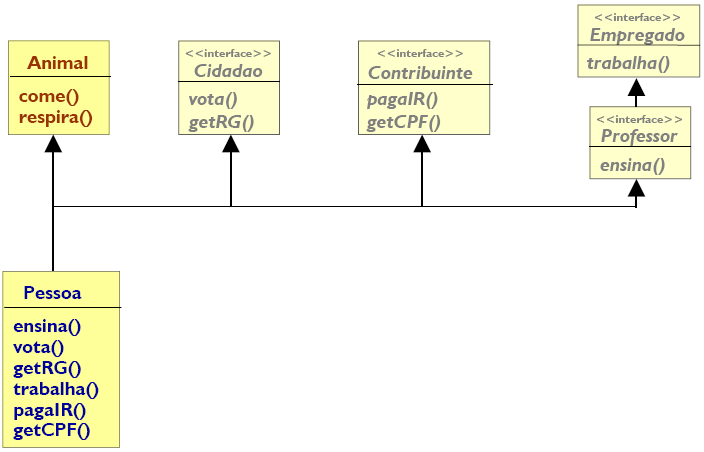

# Lista de Exercícios 7

Lista de exercícios propostos pelo **Prof. Daniel Facciolo Pires**.

+ Classes Interface

Acesse os **[Códigos](https://github.com/getuliovinicius/programacao.orientada.objeto)**.

## Exercício 1



De acordo com o Diagrama a seguir, responda:

+ Crie uma classe chamada Animal contendo os métodos `come()` e `respira()`;
+ Crie uma interface chamada Cidadao contendo os métodos abstratos `vota()` e `getRg()`;
+ Crie uma interface chamada Contribuinte contendo os métodos abstratos `pagaIR()` e `getCPF()`;
+ Crie uma interface chamada Empregado contendo o método abstrato `trabalha()`;
+ Crie uma interface chamada Professor contendo o métodos abstrato `ensina()` e que herda da interface Empregado;
+ Crie uma classe Pessoa que herda da classe Animal, e implementa as interfaces Cidadao, Contribuinte, e Professor;
+ Coloque um texto qualquer em cada método com o `System.out.println()` para mostrar que o método foi chamado;
+ Faça testes deixando de implementar certos métodos na classe Pessoa para ver as mensagens de erro obtidas;
+ Faça uma classe chamada TestaPessoa.
+ Crie um objeto do tipo Pessoa e faça-o chamar todos os métodos possíveis. Veja quais são possíveis.
+ Faça uma classe chamada Cidade. Crie os seguintes métodos:

```java
public void contrata(Professor p) {
    p.ensina();
    p.trabalha();
}

public void contrata(Empregado e) {
    e.trabalha();
}

public void cobraDe(Contribuinte c) {
    c.pagaIR();
}

public void registra(Cidadao c) {
    c.getRg();
}

public void alimenta(Animal a ) {
    a.come();
}
```

+ Faça uma classe chamada TestaPessoaCidade.
+ Crie um objeto do tipo Pessoa e um objeto do tipo Cidade.
+ Faça chamadas aos métodos como o código a seguir.
+ Analise e anote os resultados.

```java
Pessoa fulano = new Pessoa();
Cidade rp = new Cidade();
rp.contrata(fulano);
rp.contrata((Empregado) fulano);
rp.cobraDe(fulano);
rp.registra(fulano);
rp.alimenta(fulano);
```

## Exercício 2

Quais as diferenças entre uma classe interface e uma classe abstrata?
